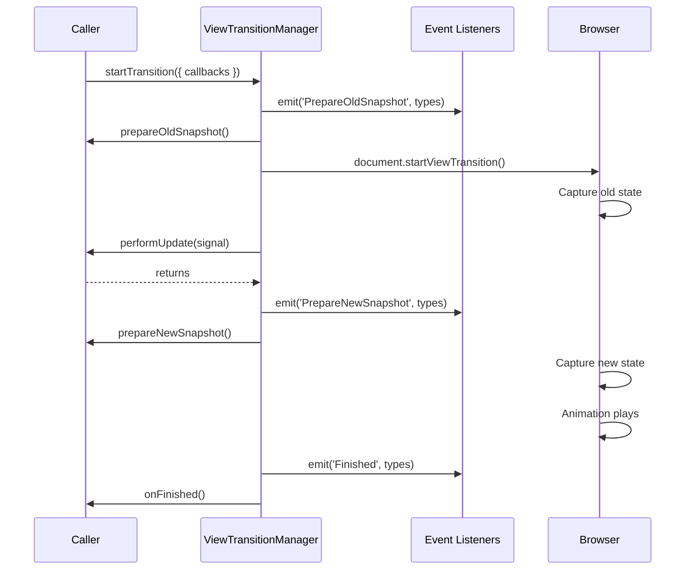
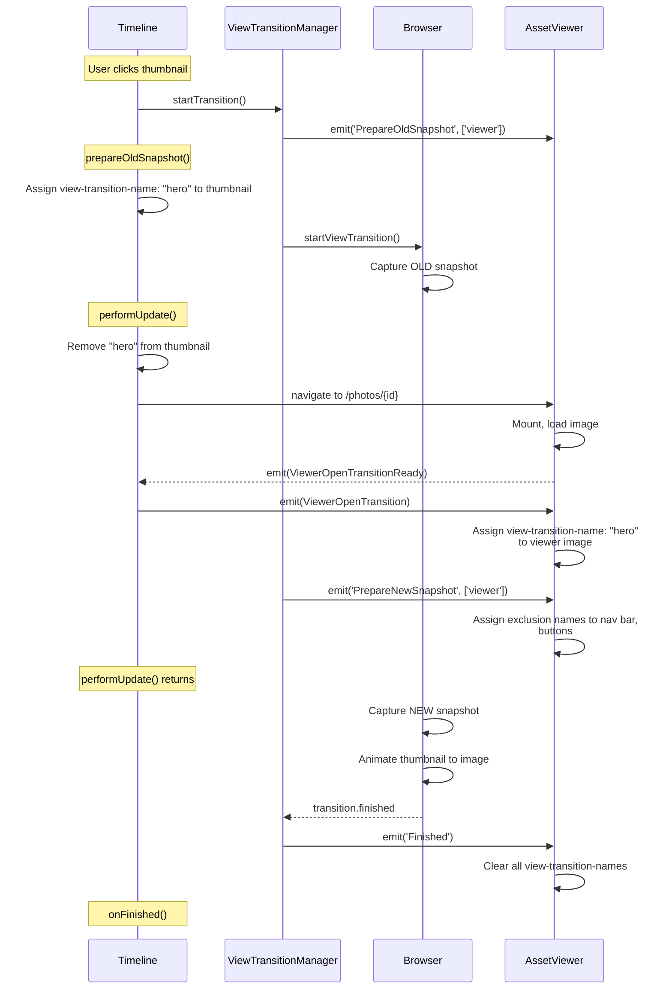
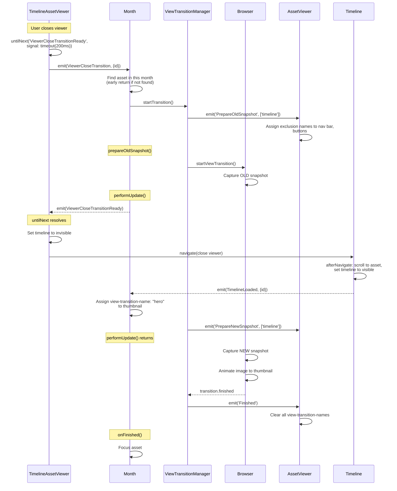

#### View Transitions

This page describes the architecture behind hero view transitions between the timeline grid and the asset viewer.

##### View Transitions 101

The [View Transition API](https://developer.mozilla.org/en-US/docs/Web/API/View_Transition_API) lets the browser animate between two DOM states automatically. The basic flow:

1. **Tag elements with names**: You assign `view-transition-name: hero` (via CSS or inline style) to a DOM element on the current page, such as a thumbnail.
2. **Capture old snapshot**: The browser takes a screenshot of every named element (position, size, appearance).
3. **Update the DOM**: You make your changes: navigate to a new page, swap components, update state. The browser holds the old screenshot on screen while this happens, so the user sees no flash.
4. **Tag the new element**: A completely different element on the new page can be given the same `view-transition-name: hero` (which is the case here: the image element in `AssetViewer`).
5. **Capture new snapshot**: The browser screenshots the new named elements.
6. **Animate**: The browser automatically performs a [FLIP-style animation](https://aerotwist.com/blog/flip-your-animations/) (First, Last, Invert, Play). It calculates the position/size delta between old and new snapshots and animates between them. The thumbnail smoothly morphs into the viewer image.

The animation is customizable via CSS pseudo-elements (`::view-transition-old(hero)`, `::view-transition-new(hero)`). Any element without a `view-transition-name` gets cross-faded as part of the page-level `::view-transition-group(root)` transition.

The key challenge is **timing**: the browser needs both snapshots tagged at exactly the right moments, but the thumbnail and viewer live in different components on different routes. We solve this with a lightweight event protocol between the participating components.

##### Why events?

The View Transition API itself is simple, but in our case the elements being animated (`Timeline` thumbnails and `AssetViewer` images) are owned by components spread across different routes and subtrees. Props and bindings can't reach across these boundaries, but a shared event bus can. Events let any component signal "I'm ready" and any other component await that signal, regardless of where they live in the tree.

##### BaseEventManager + `untilNext`

`BaseEventManager` is a typed event bus (`on`, `emit`, `once`, `hasListeners`). The key addition is `untilNext(event)`: it returns a promise that resolves the next time that event fires. This turns event-driven coordination into sequential async code:

```typescript
// Instead of callback nesting:
manager.on({
  SomeEvent: (...args) => {
    doNextThing(args);
  },
});

// You can write:
const args = await manager.untilNext('SomeEvent');
doNextThing(args);
```

It also supports a `signal` option. If the signal aborts before the event fires, the promise **resolves** (not rejects) with `undefined`. This allows graceful fallback: "wait for this event, but if nobody responds in time, move on."

##### ViewTransitionManager

Wraps the View Transition API into a request-based model with named lifecycle callbacks:

```typescript
viewTransitionManager.startTransition({
  // CSS transition type filters
  types: ['viewer'],
  // Set up view-transition-names BEFORE old snapshot
  prepareOldSnapshot: () => {},
  // Do DOM changes (navigation, state updates, set up names for new snapshot)
  performUpdate: async (signal) => {},
  // Last-chance adjustments before new snapshot
  prepareNewSnapshot: () => {},
  // Cleanup after animation completes
  onFinished: () => {},
});
```

When `viewTransitionManager.startTransition()` is called, the following sequence occurs:

1. Emits `PrepareOldSnapshot` event. Calls `prepareOldSnapshot` callback (e.g. assign `view-transition-name: hero` to the thumbnail). `await tick()` flushes the DOM.
2. Calls `document.startViewTransition()`. Browser captures old state, then invokes the transition's update callback.
3. Inside the update callback: calls `performUpdate(signal)` (e.g. navigate to viewer, wait for image to load).
4. After `performUpdate` returns: emits `PrepareNewSnapshot` event, then calls `prepareNewSnapshot` callback. This gives both event listeners and the caller a chance to tag elements for the new snapshot (e.g. `AssetViewer` listens for this to set exclusion names on its nav bar and buttons). `await tick()` flushes the DOM.
5. The update callback returns. Browser captures new state. `updateCallbackDone` resolves.
6. `transition.ready` resolves. Animation plays.
7. `transition.finished` resolves. Emits `Finished` event, then calls `onFinished` callback. Listeners use this to clean up all `view-transition-name` values.

The three events (`PrepareOldSnapshot`, `PrepareNewSnapshot`, `Finished`) are broadcast with the transition's `types` array, so listeners can filter by transition type (e.g. only act on `'viewer'` or `'timeline'` transitions).



The manager also handles a few edge cases:

- **Browser compatibility**: The View Transition API has two calling conventions. The newer form `startViewTransition({ update, types })` accepts an object with a `types` array that lets you target specific transitions with different CSS animations. Older browsers only support the function form `startViewTransition(update)`. The manager tries the object form first and falls back to the function form if it throws.
- **Overlapping transitions**: If a new transition starts while one is already active, the active transition is skipped via `skipTransition()`.
- **Abort signal**: An `AbortSignal` is created and passed to `performUpdate`. It aborts if `transition.ready` rejects, which is usually caused by coding errors like duplicate `view-transition-name` values on the same page.

##### Timeline visibility

The timeline is always rendered, even when the asset viewer is open. It is hidden using CSS `visibility: hidden` (Tailwind's `invisible` class) rather than `display: none`. The difference matters: `display: none` removes the element from the layout tree entirely (dimensions are 0), while `visibility: hidden` keeps the element fully laid out but unpainted.

The timeline's virtualization pipeline depends on real viewport dimensions:

```svelte
bind:clientHeight={timelineManager.viewportHeight}
bind:clientWidth={timelineManager.viewportWidth}
```

With `display: none`, `viewportHeight`/`viewportWidth` would be 0 and the entire virtualization would break. No months would be "near viewport," nothing would load, no positions would be calculated, and no `Month` components would mount.

With `visibility: hidden`, the timeline stays fully functional while hidden: months load, layout is computed, scroll position tracks the viewer (via `scrollAfterNavigate`), and `Month` components mount/unmount based on viewport proximity as usual. This means:

- **Closing the viewer is instant** because the timeline is already laid out (no bootstrap needed)
- **Direct navigation to `/photos/{id}` doesn't flicker** because the timeline renders silently behind the viewer
- **`Month` components are mounted** and can receive `ViewerCloseTransition` events to start the hero animation

##### View transition name assignments

Two elements participate in the hero animation:

- **Timeline thumbnail** (`AssetLayout.svelte`): When `heroTransitionAssetId` matches an asset, that thumbnail's wrapper gets `style:view-transition-name="hero"`
- **Viewer image** (`AssetViewer.svelte`): `assetViewerManager.transitionName` is set to `'hero'` during transitions

Other viewer elements get their own unique transition names during transitions (`'exclude'` for the navigation bar, `'exclude-previousbutton'` and `'exclude-nextbutton'` for the nav buttons, `'info'` for the detail panel). Without these, the browser would cross-fade them as part of the default page-level `::view-transition-group(root)` animation, creating a messy visual. Assigning unique names isolates them into separate transition groups that can be styled independently via CSS (e.g. faded out or held static). They're `undefined` outside of transitions so they don't affect normal rendering.

##### Open protocol (thumbnail to viewer)

Participants: `Timeline`, `ViewTransitionManager`, `AssetViewer`



##### Close protocol (viewer to thumbnail)

The close is more complex than the open: `TimelineAssetViewer` knows the asset but needs to find which mounted `Month` owns it, and the timeline must scroll into position and become visible before the new snapshot can be captured.

Participants: `TimelineAssetViewer`, `Month`, `ViewTransitionManager`, `AssetViewer`, `Timeline`



##### Timeout and error handling

`untilNext` has a default 10s timeout. If the awaited event never fires, the promise **rejects**, which causes `performUpdate` to throw. By the View Transition spec, a failed update callback aborts the transition. No animation plays; the browser just shows the current DOM state.

**Open timeout (10s default)**: If `ViewerOpenTransitionReady` never fires, `performUpdate` rejects and the hero animation is skipped, but the navigation to the viewer already happened (`openViewer()` fired before the `await`). The viewer opens normally, just without the animation. The likely cause would be something preventing the viewer from mounting. Every viewer type (photo, video, panorama, editor) emits `ViewerOpenTransitionReady` on both success and error, so even a failed image load or network error still emits. The 10s timeout is defensive code, just in case.

**Close timeout (200ms, explicit `AbortSignal.timeout`)**: If no mounted `Month` claims the asset, the signal aborts and `untilNext` **resolves** (not rejects) with `undefined`. `handleClose` continues normally: viewer closes, timeline appears, no hero animation. This is a shorter, intentional timeout because month virtualization creates a known (if rare) structural gap where the event can't fire.

In both cases, the navigation always succeeds. State cleanup always happens (`transition.finished` fires regardless, emitting `Finished` and clearing all `view-transition-name` values), and the app is in a consistent state afterward. The hero animation is a visual enhancement; its failure is invisible beyond the missing animation.
